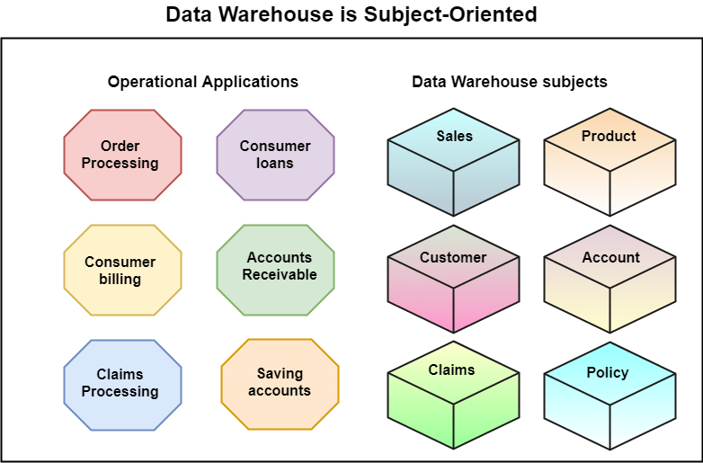
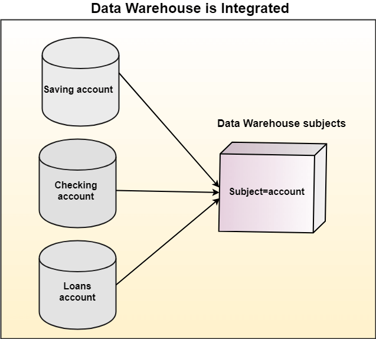
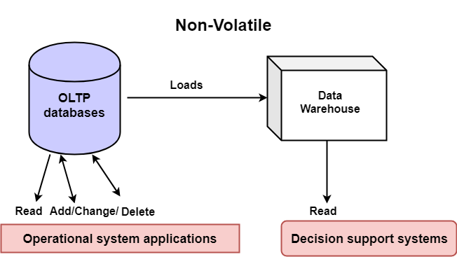

# Data warehouse

# Content

- [Data warehouse](#data-warehouse)
- [Content](#content)
  - [Previous Year Questions](#previous-year-questions)
    - [Short](#short)
    - [long](#long)
  - [Topics](#topics)
    - [Data Warehouse(DW) `important`](#data-warehousedw-important)
    - [Characteristics of Data Warehouse `important`](#characteristics-of-data-warehouse-important)
      - [Subject-Oriented](#subject-oriented)
      - [Integrated](#integrated)
      - [Time-variant](#time-variant)
      - [Non-volatile](#non-volatile)
  - [REFERENCES](#references)

## Previous Year Questions

### Short

1. Advantage of Data Warehouse
2. Briefly state difference between Data Warehouse and Data Mart.
3. List Characteristics of Data Warehouse.

### long

1. What is a Data Warehouse? What are the characteristics of a data warehouse? What is the
   need for a data warehouse? `important`
2. How much does a data warehouse cost? Write their applications and uses.
3. Discuss the steps of building data warehouse by considering various technical aspects.
4. Explain the Design/Technical/Implementation considerations to build a Data Warehouse.
5. Define Data Warehousing. What is the need for data warehousing? Discuss the structure of a
   data warehouse.
6. What are the various designs Consideration of a Data Warehouse? Why data summarization and
   Data cleaning is done?
7. Elaborate the concept of discovery driven exploration of Data Warehouse with the help of an
   example.`2 times`
8. Elaborate the 3-tier data warehouse architecture.
9. What is Data Warehouse? Discuss its architecture with the help of diagram.

## Topics

### Data Warehouse(DW) `important`

- It is Relational database that is designed for query and analysis rather than transaction processing.
- It is not used for daily operations and transaction processing but used for making decisions.
- It focuses on providing support for decision-makers for data modeling and analysis.
- It includes historical data derived from transaction data from multiple sources.

- It can be viewed as a data system with the following attributes:
  - It is a database designed for investigative tasks, using data from various applications.
  - It supports a relatively small number of clients with relatively long interactions.
  - It includes current and historical data to provide a historical perspective of information.
  - Its usage is read-intensive.
  - It contains a few large tables.

### Characteristics of Data Warehouse `important`

#### Subject-Oriented

- It delivers information about a theme instead of organization’s current operations.
- These themes can be sales, distributions, marketing etc.

Details

A data warehouse target on the modeling and analysis of data for decision-makers. Therefore, data warehouses typically provide a concise and straightforward view around a particular subject or theme, such as customer, product, or sales, instead of the organization’s current operations. This is done by excluding data that are not useful concerning the subject and including all data needed by the users to understand the subject.

 

  

#### Integrated

- Integrates various heterogeneous data sources like RDBMS, flat files, and online transaction records.

Details

A data warehouse integrates various heterogeneous data sources like RDBMS, flat files, and online transaction records. It requires performing data cleaning and integration during data warehousing to ensure consistency in naming conventions, attributes types, etc., among different data sources

 

  

#### Time-variant

Data is organized via time-periods (weekly, monthly, annually, etc.).

Details

Historical information is kept in a data warehouse. For example, one can retrieve files from 3 months, 6 months, 12 months, or even previous data from a data warehouse. These differ from transaction system, where often only the most current file is kept.

#### Non-volatile

- Defines that once entered into the warehouse, the data should not change.
- The operational updates of data ( i.e., update, insert, and delete) do not occur.
- Only require initial loading and accessing of data.
- Does not require transaction processing, recovery, and concurrency capabilities,

Details

The data warehouse is a physically separate data storage, which is transformed from the source operational RDBMS. The operational updates of data do not occur in the data warehouse, i.e., update, insert, and delete operations are not performed. It usually requires only two procedures in data accessing: Initial loading of data and access to data. Therefore, the DW does not require transaction processing, recovery, and concurrency capabilities, which allows for substantial speedup of data retrieval. Non-Volatile defines that once entered into the warehouse, and data should not change.

 

  

## REFERENCES

- [www.javatpoint.com](https://www.javatpoint.com/data-warehouse)

- [www.geeksforgeeks.org](https://www.geeksforgeeks.org/characteristics-and-functions-of-data-warehouse/)
