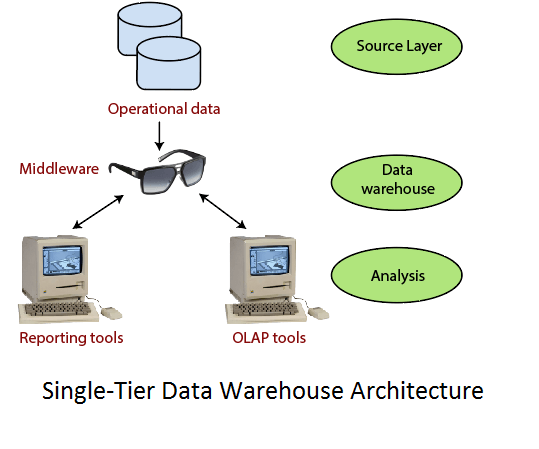
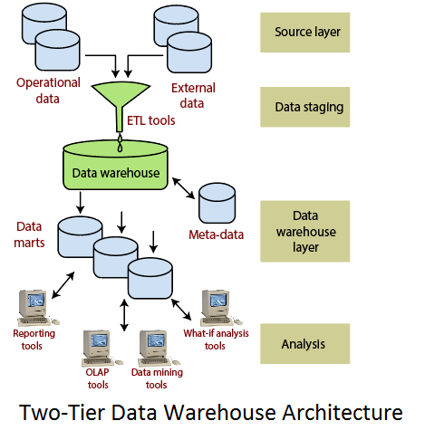

# Data warehouse

# Content

- [Data warehouse](#data-warehouse)
- [Content](#content)
  - [Previous Year Questions](#previous-year-questions)
    - [Short](#short)
    - [long](#long)
  - [Topics](#topics)
    - [Data Warehouse(DW) `important`](#data-warehousedw-important)
      - [REFERENCES](#references)
    - [Characteristics of Data Warehouse `important`](#characteristics-of-data-warehouse-important)
      - [Subject-Oriented](#subject-oriented)
      - [Integrated](#integrated)
      - [Time-variant](#time-variant)
      - [Non-volatile](#non-volatile)
      - [REFERENCES](#references-1)
    - [Need of Data Warehouse](#need-of-data-warehouse)
      - [Business User](#business-user)
      - [Store historical data](#store-historical-data)
      - [Make strategic decisions](#make-strategic-decisions)
      - [For data consistency and quality](#for-data-consistency-and-quality)
      - [High response time](#high-response-time)
      - [REFERENCES](#references-2)
    - [Advantages of Data Warehouse](#advantages-of-data-warehouse)
      - [REFERENCES](#references-3)
    - [Applications of Data Warehouse](#applications-of-data-warehouse)
    - [Architecture(Structure) of Data Warehouse](#architecturestructure-of-data-warehouse)
      - [Properties of Data Warehouse Architectures](#properties-of-data-warehouse-architectures)
        - [Separation](#separation)
        - [Scalability](#scalability)
        - [Extensibility](#extensibility)
        - [Security](#security)
        - [Administerability](#administerability)
      - [Single-Tier Architecture](#single-tier-architecture)
      - [Two-Tier Architecture](#two-tier-architecture)
      - [Three-Tier Architecture `important`](#three-tier-architecture-important)
      - [REFERENCES](#references-4)
    - [Cost of data warehouse](#cost-of-data-warehouse)
      - [REFERENCES](#references-5)

## Previous Year Questions

### Short

1. Advantage of Data Warehouse
2. Briefly state difference between Data Warehouse and Data Mart.
3. List Characteristics of Data Warehouse.

### long

1. What is a Data Warehouse? What are the characteristics of a data warehouse? What is the
   need for a data warehouse? `important`
2. Elaborate the 3-tier data warehouse architecture.
3. What is Data Warehouse? Discuss its architecture with the help of diagram.
4. Define Data Warehousing. What is the need for data warehousing? Discuss the structure of a
   data warehouse.
5. How much does a data warehouse cost? Write their applications and uses.
6. Discuss the steps of building data warehouse by considering various technical aspects.
7. Explain the Design/Technical/Implementation considerations to build a Data Warehouse.
8. What are the various designs Consideration of a Data Warehouse? Why data summarization and
   Data cleaning is done?
9. Elaborate the concept of discovery driven exploration of Data Warehouse with the help of an
   example.`2 times`

## Topics

### Data Warehouse(DW) `important`

- It is Relational database that is designed for query and analysis rather than transaction processing.
- It is not used for daily operations and transaction processing but used for making decisions.
- It focuses on providing support for decision-makers for data modeling and analysis.
- It includes historical data derived from transaction data from multiple sources.

- It can be viewed as a data system with the following attributes:
  - It is a database designed for investigative tasks, using data from various applications.
  - It supports a relatively small number of clients with relatively long interactions.
  - It includes current and historical data to provide a historical perspective of information.
  - Its usage is read-intensive.
  - It contains a few large tables.

#### REFERENCES

- [www.javatpoint.com](https://www.javatpoint.com/data-warehouse)

### Characteristics of Data Warehouse `important`

#### Subject-Oriented

- It delivers information about a theme instead of organization’s current operations.
- These themes can be sales, distributions, marketing etc.

Details

A data warehouse target on the modeling and analysis of data for decision-makers. Therefore, data warehouses typically provide a concise and straightforward view around a particular subject or theme, such as customer, product, or sales, instead of the organization’s current operations. This is done by excluding data that are not useful concerning the subject and including all data needed by the users to understand the subject.

 

  

#### Integrated

- Integrates various heterogeneous data sources like RDBMS, flat files, and online transaction records.

Details

A data warehouse integrates various heterogeneous data sources like RDBMS, flat files, and online transaction records. It requires performing data cleaning and integration during data warehousing to ensure consistency in naming conventions, attributes types, etc., among different data sources

 

  

#### Time-variant

Data is organized via time-periods (weekly, monthly, annually, etc.).

Details

Historical information is kept in a data warehouse. For example, one can retrieve files from 3 months, 6 months, 12 months, or even previous data from a data warehouse. These differ from transaction system, where often only the most current file is kept.

#### Non-volatile

- Defines that once entered into the warehouse, the data should not change.
- The operational updates of data ( i.e., update, insert, and delete) do not occur.
- Only require initial loading and accessing of data.
- Does not require transaction processing, recovery, and concurrency capabilities,

Details

The data warehouse is a physically separate data storage, which is transformed from the source operational RDBMS. The operational updates of data do not occur in the data warehouse, i.e., update, insert, and delete operations are not performed. It usually requires only two procedures in data accessing: Initial loading of data and access to data. Therefore, the DW does not require transaction processing, recovery, and concurrency capabilities, which allows for substantial speedup of data retrieval. Non-Volatile defines that once entered into the warehouse, and data should not change.

 

  

#### REFERENCES

- [www.javatpoint.com](https://www.javatpoint.com/data-warehouse)

- [www.geeksforgeeks.org](https://www.geeksforgeeks.org/characteristics-and-functions-of-data-warehouse/)

### Need of Data Warehouse

#### Business User

Business users require a data warehouse to view summarized data from the past. Since these
people are non-technical, the data may be presented to them in an elementary form.

#### Store historical data

Data Warehouse is required to store the time variable data from the past. This input is made
to be used for various purposes.

#### Make strategic decisions

Some strategies may be depending upon the data in the data warehouse. So, data warehouse contributes
to making strategic decisions.

#### For data consistency and quality

Bringing the data from different sources at a commonplace, the user can effectively undertake to
bring the uniformity and consistency in data.

#### High response time

The data warehouses are designed to read intensive; therefore, they have a relatively fast response
time than other databases.

#### REFERENCES

- [www.javatpoint.com](https://www.javatpoint.com/data-warehouse)

### Advantages of Data Warehouse

- Understand business trends and make better forecasting decisions.
- Data Warehouses are designed to perform well enormous amounts of data.
- The structure of data warehouses is more accessible for end-users to navigate, understand,
  and query.
- Queries that would be complex in many normalized databases could be easier to build and
  maintain in data warehouses.
- Provide the capabilities to analyze a large amount of historical data.
- Efficient method to manage demand for lots of information from lots of users.

#### REFERENCES

- [www.javatpoint.com](https://www.javatpoint.com/data-warehouse)

### Applications of Data Warehouse

See applications [here](https://datawarehouseinfo.com/data-warehouse/applications-of-a-data-warehouse/)

### Architecture(Structure) of Data Warehouse

#### Properties of Data Warehouse Architectures

##### Separation

Analytical and transactional processing should be keep apart as much as possible.

##### Scalability

Hardware and software architectures should be simple to upgrade

##### Extensibility

The architecture should be able to integrate new operations and technologies without redesigning the
whole system.

##### Security

Monitoring accesses are necessary because of the strategic data stored in the data warehouses.

##### Administerability

Data Warehouse management should not be complicated.

#### Single-Tier Architecture

 

  

 

- Not common in practice.

- Its purpose is to minimize the amount of data stored to reach this goal; it removes data redundancies.

- Only physical layer is source layer and data warehouse is virtual.

- Data warehouse is implemented as a multidimensional view of operational data.

- Fail to meet separation property of data warehouse architecture.

#### Two-Tier Architecture

 

  

 

- Satisfy requirement of separation.
- Consists of four subsequent data flow stages:

  1. **Source layer**

     - A data warehouse system uses a heterogeneous source of data.
     - The data may come from corporate relational databases or information system outside the
       corporate walls.

  2. **Data Staging**

     - Source data extracted, cleansed to remove inconsistencies and fill gaps, and integrated to
       merge heterogeneous sources into one standard schema.

  3. **Data Warehouse layer**

     - Information is saved to one logically centralized individual repository: a data warehouse.
     - The data warehouses can be directly accessed, but it can also be used as a source for creating
       data marts.
     - Data marts replicate data warehouse contents and are designed for specific enterprise departments.
     - Meta-data repositories store information on sources, access procedures, data staging, users,
       data mart schema, and so on.

  4. **Analysis**

     - Data is accessed to issue reports, dynamically analyze information, and simulate hypothetical
       business scenarios.
     - It should feature aggregate information navigators, complex query optimizers, and customer-friendly
       GUIs.

#### Three-Tier Architecture `important`

 

  

 

- **Bottom tier:** This tier contains the database server used to extract data from many different sources, such as from transactional databases used for front-end applications.

- **Middle tier:** The middle tier houses an OLAP server, which transforms the data into a structure better suited for analysis and complex querying.

  The OLAP server can work in two ways:

  - **A Relational OLAP (ROLAP) model:** an extended relational DBMS that maps functions on multidimensional data to standard relational operations.

  - **A Multidimensional OLAP (MOLAP) model:** a particular purpose server that directly implements multidimensional information and operations.

- **Top tier:** The top tier is the client layer. This tier holds the tools used for high-level data analysis, querying reporting, and data mining.

#### REFERENCES

- [www.javatpoint.com](https://www.javatpoint.com/data-warehouse-architecture)

- [www.panoply.io](https://panoply.io/data-warehouse-guide/data-warehouse-architecture-traditional-vs-cloud/)

### Cost of data warehouse

Components that effect the cost of a data warehouse:

- storage,
- softwares,
- human resources

1. **Storage:** you can store your data warehouse on in-house servers or in the cloud.

   1. **Cloud Storage:**

      - Three types of cloud-based storage: cold, warm, and hot storage.
      - Temperature of your data determines how often that data is accessed.
      - Since your data warehouse will be feeding into your analytics, you will
        need “hot” storage.
      - Price breakdown for three of the top “hot” storage solutions:
        1. **Amazon Redshift**
           - costs 0.08$ per GB.
           - flat cost, meaning that the prices won’t go up or down depending on your data use.
           - expensive than other solutions.
           - costs $1000+ per TB per year.
        2. **Google BigQuery**
           - costs 0.02$ per GB.
           - variable cost.
           - additional access prices -- charges extra $0.05 for every 100GB that the service accesses
             for you.
           - costs $720+ per TB per year
        3. **Microsoft Azure**
           - Blob pricing modal -- prices go up the more data that you store.
           - first 50 TB per month, costs 0.0184$ per GB, after that, the prices go up.
           - additional access prices -- every 10,000 write operations will cost an extra 0.05$.
           - costs $700+ per TB per year.

   2. **In-house storage:**
      Storage costs for an in-house data warehouse can be $12K per month.

   **Total storage cost estimate:** every additional TB of data will cost $1000 per year. An a mid-sized data warehouse would use about $12,000 per year in storage alone.

2. **Software:**

   1. **Data Centralization**
      1. **Apache Hadoop:** Open source.
      2. **Talend:** Open source.
      3. **FlyData:** Pricing is variable, and ranges anywhere between $200 and $2000 per month.
      4. **RJMetrics:** costs between $500 and $2000 per month.
   2. **Data Visualization**
      1. **R:** Open source.
      2. **D3.js:** Open source.
      3. **Chartio:** between $500 and $2000 per month.
      4. **Tableau:** $70 per user, per month.
      5. **QlikView:** $25 per user.

   **Total cost for software:** taking a conservative median price for both ETL and visualization
   software, projected costs will most likely be around $2000 per month, or $24,000 per year.

3. **Human Resources:**

   1. **Information Systems (IS) Manager:**

      - An IS Manager is required to oversee the team running your warehouse and keep all the
        systems in check.
      - $7000-10,000 per month

   2. **Backend Developer:**

      - Responsible for installing and maintaining all of your ETL software and making sure that
        it is working in tandem with your storage service.
      - $6000-8000 per month.

   3. **Database Architect (DBA):**

      - Determine the structural requirements of your data warehouse and propose the best solution
        for unifying all of your existing data sources into it.
      - $10,000-12,000 per month.

   4. **Data Analyst:**

      - Responsible for analyzing and visualizing your business intelligence in a way that will
        produce actionable insights.
      - $5000-8000 per month.

   **Total cost of human resources:** Assuming you only get one person for each position outlined
   above, your costs can be as high as $28,000-$38,000 a month, or roughly $432,000 a year.

**Total yearly cost estimate** for storage, software, and staff will be around $468,000.

#### REFERENCES

- [www.cooladata.com](https://www.cooladata.com/cost-of-building-a-data-warehouse/)
