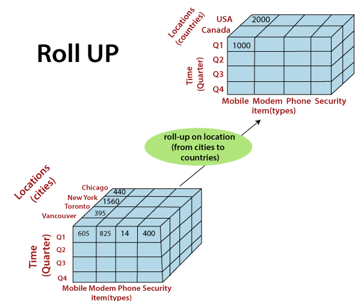
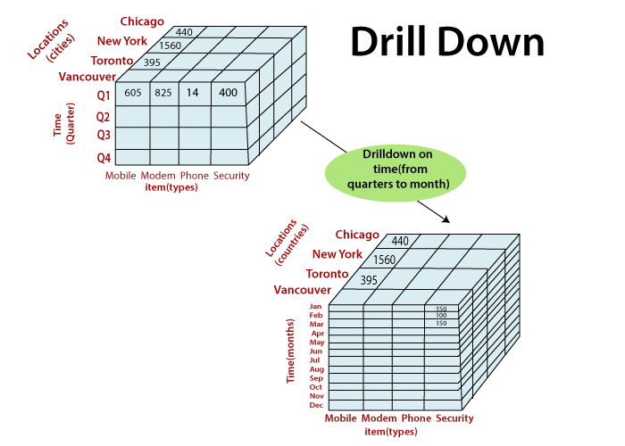
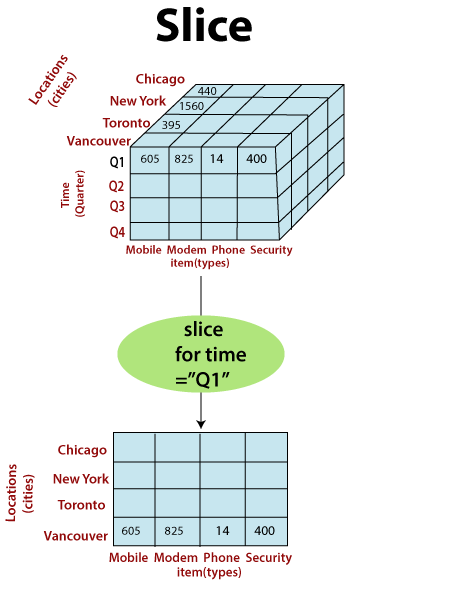
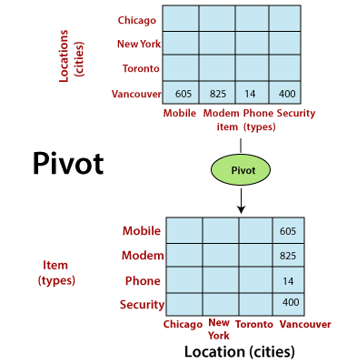

# OLAP & OLTP & OLAM

# Content

- [OLAP & OLTP & OLAM](#olap--oltp--olam)
- [Content](#content)
  - [Previous Year Questions](#previous-year-questions)
    - [Short](#short)
    - [Long](#long)
  - [Topics](#topics)
    - [Online Analytical Processing (OLAP)](#online-analytical-processing-olap)
      - [REFERENCES](#references)
    - [Purpose of OLAP](#purpose-of-olap)
      - [REFERENCES](#references-1)
    - [How OLAP works?](#how-olap-works)
      - [REFERENCES](#references-2)
    - [OLAP Application](#olap-application)
      - [Finance and accounting:](#finance-and-accounting)
      - [Sales and Marketing](#sales-and-marketing)
      - [Production](#production)
      - [REFERENCES](#references-3)
    - [OLAP Operations `important`](#olap-operations-important)
      - [Roll up](#roll-up)
      - [Roll down](#roll-down)
      - [Slice](#slice)
      - [Dice](#dice)
      - [Pivot](#pivot)
      - [REFERENCES](#references-4)
    - [Types of OLAP](#types-of-olap)
      - [Multidimensional OLAP (MOLAP)](#multidimensional-olap-molap)
      - [Relational OLAP (ROLAP)](#relational-olap-rolap)
      - [Hybrid OLAP (HOLAP)](#hybrid-olap-holap)
      - [REFERENCES](#references-5)
    - [Online transaction processing (OLTP)](#online-transaction-processing-oltp)
      - [REFERENCES](#references-6)
    - [OLAP vs OLTP](#olap-vs-oltp)
    - [Miscellaneous](#miscellaneous)
      - [What is Indexing & Querying in OLAP?](#what-is-indexing--querying-in-olap)

## Previous Year Questions

### Short

1. What is OLAP data warehouse?
2. What is indexing?
3. What is Indexing & Querying in OLAP? `2 times`
4. Differentiate OLAP & OLTP
5. What are the storage models of OLAP? `*`
6. What is OLAM? How is it different from OLAP? `*`
7. What are OLAP & OLTP?

### Long

1. What is OLAP? Discuss the architecture of OLAP in detail. `*`
2. What is OLAP and OLTP? Differentiate OLAP and OLTP. `important`
3. Define and compare OLAP and OLTP. Discuss the various OLAP operations with
   examples. `2 times` `important`
4. Explain the following with proper examples :
   1. Hyper cubes
   2. ROLAP and MOLAP

## Topics

### Online Analytical Processing (OLAP)

- approach to answer multi-dimensional analytical (MDA) queries swiftly in computing
- aid in trends analysis, financial reporting, sales forecasting, budgeting and other
  planning purposes.

#### REFERENCES

- [www.wikipedia.org](https://en.wikipedia.org/wiki/Online_analytical_processing)
- [www.searchdatamanagement.techtarget.com](https://searchdatamanagement.techtarget.com/definition/OLAP)

### Purpose of OLAP

- provide business users with a data model more intuitive to them than a
  tabular model. This model is called a Dimensional Model.
- enable fast query response that is usually difficult to achieve using
  tabular models.

#### REFERENCES

- [www.javatpoint.com](https://www.javatpoint.com/what-is-olap)

### How OLAP works?

- It pre-calculates most of the queries that are typically very hard to execute over
  tabular databases, namely aggregation, joining, and grouping.
- This process is usually called 'building' or 'processing' of the OLAP cube.
- This process happens overnight, and by the time end users get to work - data will have been
  updated.

#### REFERENCES

- [www.javatpoint.com](https://www.javatpoint.com/what-is-olap)

### OLAP Application

#### Finance and accounting:

- Budgeting
- Activity-based costing
- Financial performance analysis
- And financial modeling

#### Sales and Marketing

- Sales analysis and forecasting
- Market research analysis
- Promotion analysis
- Customer analysis
- Market and customer segmentation

#### Production

- Production planning
- Defect analysis

#### REFERENCES

- [www.javatpoint.com](https://www.javatpoint.com/what-is-olap)

### OLAP Operations `important`

#### Roll up

- Also known as consolidation, or drill-up, this operation summarizes the data along the
  dimension.
- Performs aggregation on a data cube, by climbing up concept hierarchies, i.e., dimension
  reduction.
- It is like zooming-out on the data cubes.
- Example:
   
  

    
  

#### Roll down

- is a technique that allows users to navigate through the details.
- it navigates from less detailed record to more detailed data
- can be performed by either stepping down a concept hierarchy for a dimension or adding
  additional dimensions.
- Example:
   
  

    
  

#### Slice

- This enables an analyst to take one level of information for display
- A slice is a subset of the cubes corresponding to a single value for one or more members
  of the dimension.
- Example:
   
  

    
  

#### Dice

- describes a subcube by operating a selection on two or more dimension.
- Example:
   
  

    
  

#### Pivot

- also called a rotation
- visualization operations which rotates the data axes in view to provide an
  alternative presentation of the data.
- It may contain swapping the rows and columns or moving one of the row-dimensions
  into the column dimensions.
- Example:
   
  

    
  

#### REFERENCES

- [www.javatpoint.com](https://www.javatpoint.com/olap-operations)
- [www.searchdatamanagement.techtarget.com](https://searchdatamanagement.techtarget.com/definition/OLAP)
- [www.wikipedia.org](https://en.wikipedia.org/wiki/Online_analytical_processing)

### Types of OLAP

#### Multidimensional OLAP (MOLAP)

- Stores data in an optimized multi-dimensional array storage, rather than in a relational database.
- Generally utilize a pre-calculated data set referred to as a data cube.
- The data cube contains all the possible answers to a given range of questions.
- Have a very fast response to queries.
- Updating can take a long time depending on the degree of pre-computation.
- **Advantages**

  - **Excellent Performance:** A MOLAP cube is built for fast information retrieval, and is optimal
    for slicing and dicing operations.

  - **Can perform complex calculations:** All evaluation have been pre-generated when the cube is
    created. Hence, complex calculations are not only possible, but they return quickly.

- **Disadvantages**

  - **Limited in the amount of information it can handle:** Because all calculations are performed
    when the cube is built, it is not possible to contain a large amount of data in the cube itself.

  - **Requires additional investment:** Cube technology is generally proprietary and does not already exist
    in the organization. Therefore, to adopt MOLAP technology, chances are other investments in human
    and capital resources are needed.

#### Relational OLAP (ROLAP)

- Works directly with relational databases and does not require pre-computation.
- The base data and the dimension tables are stored as relational tables and new tables are created
  to hold the aggregated information.
- It depends on a specialized schema design. A database which was designed for OLTP will not function
  well as a ROLAP database.
- This methodology relies on manipulating the data stored in the relational database to give the
  appearance of traditional OLAP's slicing and dicing functionality. In essence, each action of
  slicing and dicing is equivalent to adding a "WHERE" clause in the SQL statement.
- **Advantages**

  - **Can handle large amounts of information:** The data size limitation of ROLAP technology is depends
    on the data size of the underlying RDBMS. So, ROLAP itself does not restrict the data amount.

  - **Lot of features:** RDBMS already comes with a lot of features. So ROLAP technologies, (works on
    top of the RDBMS) can control these functionalities.

- **Disadvantages**

  - **Performance can be slow:** Each ROLAP report is a SQL query (or multiple SQL queries) in the
    relational database, the query time can be prolonged if the underlying data size is large.

  - **Not suitable for all situation:** Since ROLAP tools rely on SQL for all of the computations,
    they are not suitable when the model is heavy on calculations which don't translate well into SQL.
    Examples of such models include budgeting, allocations, financial reporting and other scenarios.

#### Hybrid OLAP (HOLAP)

- Incorporates the best features of MOLAP and ROLAP into a single architecture.
- Allows the model designer to decide which portion of the data will be stored in MOLAP and which portion
  in ROLAP.
- **Vertical partitioning:** In this mode HOLAP stores aggregations in MOLAP for fast query performance,
  and detailed data in ROLAP to optimize time of cube processing.
- **Horizontal partitioning:** In this mode HOLAP stores some slice of data, usually the more recent one in
  MOLAP for fast query performance, and older data in ROLAP

- **Advantages:**

  - HOLAP provide benefits of both MOLAP and ROLAP.
  - It provides fast access at all levels of aggregation.
  - HOLAP balances the disk space requirement, as it only stores the little information on the OLAP server
    and the detail record remains in the relational database.

- **Disadvantages:**

  - HOLAP architecture is very complicated because it supports both MOLAP and ROLAP servers.

#### REFERENCES

- [www.javatpoint.com](https://www.javatpoint.com/data-warehouse-types-of-olap)
- [www.wikipedia.org](https://en.wikipedia.org/wiki/Online_analytical_processing)

### Online transaction processing (OLTP)

- Information systems typically facilitate and manage transaction-oriented applications.
- The term "transaction" can have two different meanings, both of which might apply:
  - in the realm of computers or database transactions it denotes an atomic change of state.
  - in the realm of business or finance, the term typically denotes an exchange of economic entities.
- It may use transactions of the first type to record transactions of the second.

#### REFERENCES

- [www.wikipedia.org](https://en.wikipedia.org/wiki/Online_transaction_processing)

### OLAP vs OLTP

See comparison [here](https://www.stitchdata.com/resources/oltp-vs-olap/)

### Miscellaneous

#### What is Indexing & Querying in OLAP?
