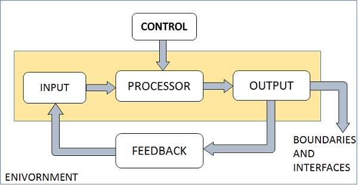

# Topic

# Content

- [Topic](#topic)
- [Content](#content)
  - [Previous Year Questions](#previous-year-questions)
    - [Short](#short)
    - [Long](#long)
  - [Topics](#topics)
    - [Definition](#definition)
    - [Characteristics](#characteristics)
      - [Organization](#organization)
      - [Interaction](#interaction)
      - [Inter-dependence](#inter-dependence)
      - [Integration](#integration)
      - [Central objective](#central-objective)
    - [Elements](#elements)
      - [Outputs and Inputs](#outputs-and-inputs)
      - [Processor(s)](#processors)
      - [Control](#control)
      - [Feedback](#feedback)
      - [Environment](#environment)
      - [Boundaries and Interface](#boundaries-and-interface)
    - [Types](#types)
      - [Physical and Abstract Systems](#physical-and-abstract-systems)
      - [Open and closed System](#open-and-closed-system)
      - [Adaptive and Non Adaptive System](#adaptive-and-non-adaptive-system)
      - [Permanent and Temporary System](#permanent-and-temporary-system)
      - [Natural and Manufactured System](#natural-and-manufactured-system)
      - [Deterministic or Probabilistic System](#deterministic-or-probabilistic-system)
      - [Social, Human-Machine, Machine System](#social-human-machine-machine-system)
      - [Man-made information System](#man-made-information-system)
    - [REFERENCES](#references)
  - [Miscellaneous](#miscellaneous)
    - [Why is system evaluation necessary?](#why-is-system-evaluation-necessary)
      - [REFERENCES](#references-1)
    - [Differentiate between sub-system and supra-system.](#differentiate-between-sub-system-and-supra-system)
    - [What is Systems Approach?](#what-is-systems-approach)
      - [REFERENCES](#references-2)

## Previous Year Questions

### Short

1. Define the concept of environment and boundary of a system with an example.
2. Write any two characteristics of a system. `2 times`
3. Write elements(components) of a system. `2 times`
4. What is an Open system? Give an example.
5. What is difference between Open and Closed System? `2 times`
6. Difference between Physical and Abstract System
7. Why is system evaluation necessary?
8. Differentiate between sub-system and supra-system.
9. What is Systems Approach? `2 times`

### Long

1. Elaborate in detail the various types of systems.
2. What are various types of systems? Explain its Characteristics.
3. What do you mean by the term ‘System’? Discuss the elements(components) and characteristics of a
   system. `2 times`
4. What do you understand by System? Explain different concepts of System with
   examples.

## Topics

### Definition

A system is an orderly grouping of inter-dependent components linked together according to a plan to
achieve a specific objective.

Components:

- physical part(engine, keyboard, wings of air craft etcetera).

- marginal part(planning, organizing, and controlling).

A component can be simple or complex, basic or advance. In either case, each component is part
of total system and has to do its fair share of work for the system to achieve the intended results.

The study of systems concepts has three basic implications:

1. A system must be design to achieve a pre-determined objective.

2. Inter-relationships and inter-dependence must exist between components.

3. The objective of a system as a whole has a higher priority than its sub-systems.

### Characteristics

#### Organization

- Means structure and order.

- Examples:

  - Business system: hierarchical organization in a company.

  - Computer system: organization of different components like input devices, output devices, CPU,
    and storage devices.

#### Interaction

- Manner in which each component or sub-system functions with other components.

- Examples:

  - CPU interacts with input devices to get data needed for processing.

  - The main memory holds the data and the programs that ALU uses for computation.

#### Inter-dependence

- Means parts depend on one another.

- All are connected together according to a plan.

- Output of one sub-system is input of another.

- Example:
  A decision to computerize an application is initiated by the user, analyzed and designed by the
  analyst, programmed and tested by the programmer, and run by the computer operator.

#### Integration

- How sub-systems are tied together to achieve the system objective.

- It means that parts of the system work together within the system even though each part performs
  a unique function.

#### Central objective

- Objectives may be real or stated.

- Although a stated objective may be the real objective, it is not uncommon for an organization to
  state one objective and operate to achieve another.

- The users must know the main objective of a computer application early in the analysis for a
  successful design and conversion.

- Real objective vs stated objective:

  A stated goal is what the company states to the public as the official mission while the real
  goals are the actual targets that the company works on throughout the year.

### Elements

#### Outputs and Inputs

 

  

 

- The main aim of a system is to produce a good output which is useful for its user.

- Inputs are the information that enters into the system for processing.

- Output is outcome of the processing.

- Output is a first step in specifying the nature, amount, and regularity of the input needed to
  operate a system.

#### Processor(s)

- It involves the actual transformation of input into output.

- It may modify the input totally or partially, depending on the output specifications.

- As the output specifications change so does the processing. In some cases, input is also modified
  to enable the processor to handle the transformation.

#### Control

- The control element guides the system.

- It is the decision – making subsystem that controls the pattern of activities governing
  input, processing, and output.

- Examples:

  - Business system: management as a decision – making body controls the inflow, handling
    and outflow of activities that affect the welfare of the business.

  - Computer system: the operating system and accompanying software influence the behavior
    of the computer.

#### Feedback

- Feedback provides the control in a dynamic system.

- Output is compared against performance standards to produce feedback.

- Two Types:

  - Positive: reinforces the performance of the system.

  - Negative: generally provides the controller with information for action.

#### Environment

- The environment is the “supersystem” within which an organization operates.

- It is the source of external elements that strike on the system.

- It often determines how a system must function.

- Example:

  Business system: the organization’s environment, consisting of vendors, competitors, and
  others, may provide constraints and, consequently, influence the actual performance of the
  business.

#### Boundaries and Interface

- Each system has boundaries that determine its sphere of influence and control.

- A system should be defined by its boundaries – the limits that identify its components,
  processes and inter-relationship when it interfaces with another system.

- Example:

  A teller system in a commercial bank is restricted to the deposits, withdrawals and related
  activities, it may exclude mortgage foreclosures, trust activities, and the like.

- Importance:

  - Knowledge of the boundaries is crucial in determining the nature of its interface with
    other systems for successful design.

  - Example:

    A customer who has a mortgage and a checking account with the same bank may write a check through the “teller system” which needs to be processed through “mortgage loan system.”

### Types

#### Physical and Abstract Systems

- Physical systems are tangible entities. We can touch and feel them.
- Two Types:

  - **Static:** desks and chairs are the physical parts of computer center.
  - **Dynamic:** a programmed computer in which programs, data, and applications can
    change according to the user's needs.

- Abstract systems are non-physical or conceptual entities which may be formulas,
  representation or modals of a the real system.

#### Open and closed System 

- Some systems are open with respect to certain elements or processes. The elements or processes
  can flow into or out of the system.
- **Example:** an automobile engine is "open" with respect to gasoline--gasoline flows in and exhaust
  flows out.

- Other systems are closed with respect to certain elements or processes. The elements or processes
  do not leave the system.
- **Example:** an automobile engine is largely "closed" with respect to
  lubricating oil--the oil does not leave the engine.

#### Adaptive and Non Adaptive System

- Adaptive System responds to the change in the environment in a way to improve their
  performance and to survive. For example, human beings, animals.

- Non Adaptive System is the system which does not respond to the environment. For example,
  machines.

#### Permanent and Temporary System

- Permanent System persists for long time. For example, business policies.

- Temporary System is made for specified time and after that they are demolished.
  For example, A DJ system is set up for a program and it is dissembled after the program.

#### Natural and Manufactured System

- Natural systems are created by the nature. For example, Solar system, seasonal system.

- Manufactured System is the man-made system. For example, Rockets, dams, trains.

#### Deterministic or Probabilistic System

- Deterministic system operates in a predictable manner and the interaction between system
  components is known with certainty. For example, two molecules of hydrogen and one molecule
  of oxygen makes water.

- Probabilistic System shows uncertain behavior. The exact output is not known. For example,
  Weather forecasting, mail delivery.

#### Social, Human-Machine, Machine System

- Social System is made up of people. For example, social clubs, societies.

- In Human-Machine System, both human and machines are involved to perform a particular
  task. For example, Computer programming.

- Machine System is where human interference is neglected. All the tasks are performed by
  the machine. For example, an autonomous robot.

#### Man-made information System 

An arrangement of people, data, processes, and information technology that interact to
collect, process, store, and provide as output the information needed to support an
organization.

### REFERENCES

- [www.padakuu.com](http://www.padakuu.com/article/2-system-definition-and-concepts-characteristics-and-types-of-system)

- [www.tutorialspoint.com](https://www.tutorialspoint.com/system_analysis_and_design/system_analysis_and_design_overview.htm)

- [www.landscapemanagementsystem.org](http://landscapemanagementsystem.org/ecosystem-management/systems.html)

- SYSTEMS ANALYSIS AND DESIGN
  BY ELIAS M. AWAD

## Miscellaneous

### Why is system evaluation necessary?

- Systematic way to understand how well it achieves its goals.
- Help determine what works well and what could be improved.

 
 

 
Details

Evaluation provides a systematic method to study a program, practice, intervention, or
initiative to understand how well it achieves its goals. Evaluations help determine what
works well and what could be improved in a program or initiative. Program evaluations can
be used to:

- Demonstrate impact to funders
- Suggest improvements for continued efforts
- Seek support for continuing the program
- Gather information on the approach that can be shared with others
- Help determine if an approach would be appropriate to replicate in other locations with
  similar needs

 

#### REFERENCES

- [www.ruralhealthinfo.org](https://www.ruralhealthinfo.org/toolkits/rural-toolkit/4/evaluation-importance#:~:text=Evaluation%20provides%20a%20systematic%20method,in%20a%20program%20or%20initiative.)

### Differentiate between sub-system and supra-system.

**Sub-system**: Some systems are part of large system and they are known as sub-system.
They are interactive and depend upon each other. They work together to achive a common goal.

Example: Human body - respiratory system, nervous system

**Supra-system**: It is a large and complex system, it may or may not have parts known as
sub-sytems. It is always complex and difficult to understand.

Example: Education system

### What is Systems Approach?

Provide common themes in the approach to managing and organizing complex systems. Four major
concepts underlie the systems approach:

- **Specialization:** A system is divided into smaller components allowing more specialized
  concentration on each component.

- **Grouping:** To avoid generating greater complexity with increasing specialization, it becomes
  necessary to group related disciplines or sub-disciplines.

- **Coordination:** As the components and subcomponents of a system are grouped, it is necessary
  to coordinate the interactions among groups.

- **Emergent properties:** Dividing a system into subsystems, requires understanding of the
  "emergent properties" of a system; that is, recognizing why the system as a whole is greater than
  the sum of its parts.

  For example, two forest stands may contain the same tree species, but the spatial arrangement and
  size structure of the individual trees will create different habitats for wildlife species. In this
  case, an emergent property of each stand is the wildlife habitat.

  #### REFERENCES

  - [www.landscapemanagementsystem.org](http://landscapemanagementsystem.org/ecosystem-management/systems.html)
