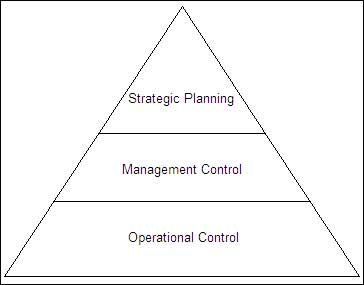

# Topic

# Content

- [Topic](#topic)
- [Content](#content)
  - [Previous Year Questions](#previous-year-questions)
    - [Short](#short)
    - [Long](#long)
  - [Topics](#topics)
    - [Robert Anthony’s Hierarchy of Management Activity](#robert-anthonys-hierarchy-of-management-activity)
      - [Strategic planning](#strategic-planning)
      - [Management Control](#management-control)
      - [Operational Control](#operational-control)
      - [REFERENCE](#reference)
    - [Structured vs Unstructured decision](#structured-vs-unstructured-decision)
      - [REFERENCE](#reference-1)

## Previous Year Questions

### Short

1. Discuss Robert Anthony's hierarchy.
2. What is structured decision in management information system?
3. Differentiate between structured and unstructured decisions `4 times` `important`

### Long

1. Elaborate the Robert Anthony’s hierarchy of management activity. `3 times` `important`

## Topics

### Robert Anthony’s Hierarchy of Management Activity

Robert N. Anthony has described three levels of management activities, which are
strategic planning, management control and operational control.

#### Strategic planning

- It is the process of deciding the objectives of the organisation, changes required in achieving
  these objectives, resources used to obtain these objectives and the policies that are used in the
  acquisition, use and disposition of these resources.
- Its activities are performed by top management.
- It helps the organisationto forsee its future in the long run and thus helps the management to
  take steps accordingly.
- It helps in policy formulation to clear the goals of organisation.
- Middle level management is benefited from strategic planning through smooth application of the
  policies formulated by the top management.

#### Management Control

- It is the process by which managers ensure that the resources are obtained and used
  effectively and efficiently in order to achieve the organisational goals.
- Its activities are performed by middle management.
- It facilitates smooth operational activities in the organisation.
- It is important for the management to keep a check on the operations and people involved in
  operations to avoid any wastage of resources and helps in utilising the resources efficiently
  and effectively.
- It also includes the management of various projects that the organisation is handling.

#### Operational Control

- It is the process of ensuring that specific tasks are carried out effectively and efficiently.
- Its activities are performed by low level management.
- It helps in full utilisation of the resources available without any wastage.
- It requires proper handling of machine with reduced cost and depreciation.
- It also helps in managing the workers involved in operations through proper supervision to produce
  quality products in desirable time.

 

  

#### REFERENCE

- [www.academia.edu](https://www.academia.edu/35976719/MANAGEMENT_INFORMATION_SYSTEMS_BCA_302)

### Structured vs Unstructured decision

<table>
  <tr>
    <th>Topic</th>
    <th>Structured </th>
    <th>Unstructured </th>
  </tr>
  <tr>
    <td>Situation</td>
    <td>
      made under the established situations  
      e.g hiring a new employee
    </td>
    <td>
      made under the emergent situation  
      e.g fire breakout
    </td>
  </tr>

  <tr>
    <td>Planning</td>
    <td>
      programmable and pre-planned  
      e.g the payroll for employees
    </td>
    <td>
      creative and they are not preplanned  
      e.g if fire break there and then manager can make   
      decision unplanned.
    </td>
  </tr>

  <tr>
    <td>Task</td>
    <td>
      made for routine tasks  
      e.g. hiring of new IT specialists 
    </td>
    <td>
      made for a sudden one-shot kind of situations  
      e.g. dealing with a labor strike in a factory.
    </td>
  </tr>

  <tr>
    <td>Process</td>
    <td>
      made for specified processes like specialized  
      manufacturing processes 
    </td>
    <td>
      made for general processes.
    </td>
  </tr>

  <tr>
    <td>Method</td>
    <td>
     have well defined methodology for finding a solution and have 
     the data to reach a decisions  
     e.g. whether or not to withdraw funds from an international account   
     depending on the current exchange rate
    </td>
    <td>
      rely on knowledge and/or expertise and often require 
      data and models to solve 
      e.g. deciding on which market to target
    </td>
  </tr>
</table>

#### REFERENCE

- [www.brainly.in](https://brainly.in/question/7323584#:~:text=Structured%20decisions%20are%20made%20in,situations%20are%20uncertain%20and%20unclear.&text=Structured%20decisions%20have%20a%20well,data%20to%20reach%20a%20decisions.)
