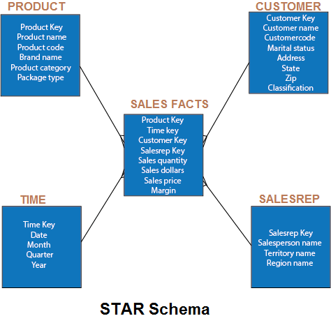
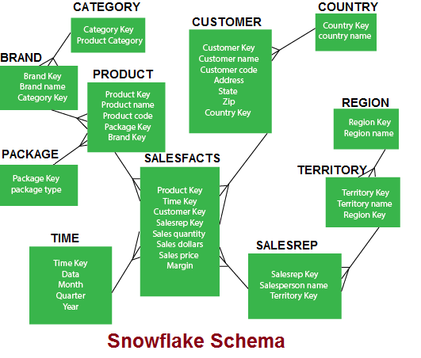

# Multidimensional Data Model

# Content

- [Multidimensional Data Model](#multidimensional-data-model)
- [Content](#content)
  - [Previous Year Questions](#previous-year-questions)
    - [Short](#short)
    - [Long](#long)
  - [Topics](#topics)
    - [Multi-Dimensional Data Model](#multi-dimensional-data-model)
      - [REFERENCES](#references)
    - [Star Schema](#star-schema)
      - [Fact table](#fact-table)
      - [Dimension Tables](#dimension-tables)
      - [Characteristics of Star Schema](#characteristics-of-star-schema)
      - [Advantages of Star Schema](#advantages-of-star-schema)
      - [Disadvantage of Star Schema](#disadvantage-of-star-schema)
      - [REFERENCE](#reference)
    - [Snowflake Schema](#snowflake-schema)
      - [Advantage of Snowflake Schema](#advantage-of-snowflake-schema)
      - [Disadvantage of Snowflake Schema](#disadvantage-of-snowflake-schema)
      - [REFERENCES](#references-1)
    - [Difference between snowflake schema and star schema](#difference-between-snowflake-schema-and-star-schema)
    - [Fact Constellation Schema](#fact-constellation-schema)
      - [REFERENCES](#references-2)

## Previous Year Questions

### Short

1. What is multidimensional data? Give two examples.
2. What is Star Schema? `2 times`
3. Briefly discuss the Snowflake schema.

### Long

1. Explain the various schemas for multidimensional data model `3 times`
2. What is multidimensional data model? Discuss the schemas for multidimensional data.
3. Explain Star & Snowflake database schema in detail. Also construct a fact table of star schema. `2 times`
4. Differentiate star and snowflake schemas of warehouse.
5. Write a detailed note on fact constellation, its advantages and related concepts.

## Topics

### Multi-Dimensional Data Model

- views data in the form of a data-cube
- A data cube enables data to be modeled and viewed in multiple dimensions. It is defined by dimensions
  and facts.
- The dimensions are the perspectives or entities which an organization keeps records
- **For example**, a shop may create a sales data warehouse to keep records of the store's sales for
  the dimension time, item, and location.
- These dimensions allow the store to keep track of things, for example, monthly sales of items and
  the locations at which the items were sold.
- Each dimension has a table related to it, called a dimensional table, which describes the
  dimension further. For example, a dimensional table for an item may contain the attributes
  item_name, brand, and type.
- A multidimensional data model is organized around a central theme, for example, sales. This theme
  is represented by a fact table.

#### REFERENCES

- [www.javatpoint.com](https://www.javatpoint.com/data-warehouse-what-is-multi-dimensional-data-model)

### Star Schema

- elementary form of a dimensional model
- data are organized into facts and dimensions
- **fact** is an event that is counted or measured, such as a sale or log in
- **dimension** includes reference data about the fact, such as date, item, or customer
- It is known as star schema because the entity-relationship diagram of this schemas simulates a
  star, with points, diverge from a central table
- The center of the schema consists of a large fact table, and the points of the star are the
  dimension tables.

 

  

Example:

 

  

#### Fact table

- contains facts and connected to dimensions
- Fact table has two types of columns: those that include fact and those that are foreign keys to the
  dimension table
- The primary key of the fact tables is generally a composite key that is made up of all of its
  foreign keys.
- A fact table might involve either detail level fact or fact that have been aggregated
  (fact tables that include aggregated fact are often instead called summary tables)
- A fact table generally contains facts with the same level of aggregation.

#### Dimension Tables

- usually composed of one or more hierarchies that categorize data
- If a dimension has not got hierarchies and levels, it is called a flat dimension or list
- The primary keys of each of the dimensions table are part of the composite primary keys of
  the fact table
- Dimensional attributes help to define the dimensional value. They are generally descriptive,
  textual values.

#### Characteristics of Star Schema

- It creates a DE-normalized database that can quickly provide query responses.
- It provides a flexible design that can be changed easily or added to throughout the development
  cycle, and as the database grows.
- It provides a parallel in design to how end-users typically think of and use the data.
- It reduces the complexity of metadata for both developers and end-users.

#### Advantages of Star Schema

**Query Performance**
A star schema database has a limited number of table and clear join paths, the query run faster
than they do against OLTP systems

**Load performance and administration**

Structural simplicity also decreases the time required to load large batches of record into a
star schema database.

Dimension table can be populated once and occasionally refreshed. We can add new facts regularly and selectively by appending records to a fact table.

**Built-in referential integrity**

A star schema has referential integrity built-in when information is loaded. Referential integrity
is enforced because each data in dimensional tables has a unique primary key, and all keys in the
fact table are legitimate foreign keys drawn from the dimension table.

**Easily Understood**

A star schema is simple to understand and navigate, with dimensions joined only through the fact
table. These joins are more significant to the end-user because they represent the fundamental
relationship between parts of the underlying business. Customer can also browse dimension table
attributes before constructing a query.

#### Disadvantage of Star Schema

There is some condition which cannot be meet by star schemas like the relationship between the user,
and bank account cannot describe as star schema as the relationship between them is many to many.

#### REFERENCE

- [www.javatpoint.com](https://www.javatpoint.com/data-warehouse-what-is-star-schema)

### Snowflake Schema

- A schema is known as a snowflake if one or more dimension tables do not connect directly to the
  fact table but must join through other dimension tables

- It is an expansion of the star schema where each point of the star explodes into more points
- It is called snowflake schema because the diagram of snowflake schema resembles a snowflake
- Snowflaking is a method of normalizing the dimension tables in a STAR schemas. When we normalize
  all the dimension tables entirely, the resultant structure resembles a snowflake with the fact table
  in the middle.

Example:

 

  

#### Advantage of Snowflake Schema

- The primary advantage of the snowflake schema is the development in query performance due to
  minimized disk storage requirements and joining smaller lookup tables.
- It provides greater scalability in the interrelationship between dimension levels and components.
- No redundancy and therefore more easy to maintain and change

#### Disadvantage of Snowflake Schema

- The primary disadvantage of the snowflake schema is the additional maintenance efforts required
  due to the increasing number of lookup tables. It is also known as a multi fact star schema.
- There are more complex queries and hence, difficult to understand.
- More tables more join so more query execution time.

#### REFERENCES

- [www.javatpoint.com](https://www.javatpoint.com/data-warehouse-what-is-snowflake-schema)

### Difference between snowflake schema and star schema

See difference [here](https://www.javatpoint.com/data-warehouse-star-schema-vs-snowflake-schema)

### Fact Constellation Schema

- A Fact constellation means two or more fact tables sharing one or more dimensions. It is also
  called Galaxy schema.
- See example [here](https://www.geeksforgeeks.org/fact-constellation-in-data-warehouse-modelling/)

#### REFERENCES

- [www.geeksforgeeks.org](https://www.geeksforgeeks.org/fact-constellation-in-data-warehouse-modelling/)
- [www.javatpoint.com](https://www.javatpoint.com/data-warehouse-what-is-fact-constellation-schema)
