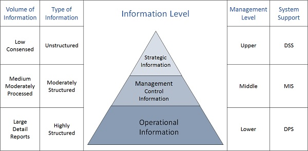

# Information

# Content

- [Information](#information)
- [Content](#content)
  - [Previous Year Questions](#previous-year-questions)
    - [Short](#short)
    - [Long](#long)
  - [Topics](#topics)
    - [Categories](#categories)
      - [Strategic Information](#strategic-information)
      - [Managerial Information](#managerial-information)
      - [Operational Information](#operational-information)
      - [REFERENCES](#references)
    - [Role of Information in decision making](#role-of-information-in-decision-making)
      - [REFERENCES](#references-1)
  - [Miscellaneous](#miscellaneous)
    - [Enlist structured analysis tools to manage information](#enlist-structured-analysis-tools-to-manage-information)
      - [REFERENCES](#references-2)
    - [Enlist automated tools for information management](#enlist-automated-tools-for-information-management)

## Previous Year Questions

### Short

1. Define Strategic information. Give examples. `2 times`
2. Enlist automated tools for information management.
3. Enlist structured analysis tools to manage information
4. Write different categories of Information.
5. What do you mean by three levels of management? `2 times`

### Long

1. What is formation system? Explain the role of information in taking decision.
2. What is the role of information in decision making?

## Topics

### Categories

There are three categories of information related to managerial levels and the decision managers make.

 

  

#### Strategic Information

- This information is required by topmost management for long range planning policies for next
  few years.
- For example, trends in revenues, financial investment, and human resources, and
  population growth.
- Achieved with the aid of Decision Support System (DSS).

#### Managerial Information

- This type of Information is required by middle management for short and intermediate range
  planning which is in terms of months.
- For example, sales analysis, cash flow projection, and annual financial statements.
- Achieved with the aid of Management Information Systems (MIS).

#### Operational Information

- This type of information is required by low management for daily and short term planning to enforce
  day-to-day operational activities.
- For example, keeping employee attendance records, overdue purchase orders, and current stocks available.
- Achieved with the aid of Data Processing Systems (DPS).

#### REFERENCES

- [www.tutorialspoint.com](https://www.tutorialspoint.com/system_analysis_and_design/system_analysis_and_design_overview.htm)

### Role of Information in decision making

Information plays a vital role in decision-making. Even to take very simple decisions, we need
information.

To understand the role played by information in decision-making, we have to understand
how decisions are taken.

Imagine a simple decision like the one a driver (say) makes when he puts on the brakes to stop a
speeding vehicle when he sees a child crossing the road (in middle of the road). The driver decides
on braking based on a lot of information processing that happens in his brain.

**Breaking down stages of decision making:**

1. **Identification and structuring of problem**

   One needs information to identify a problem and put it in a structured manner. Without
   information about the problem, the decision-making process does not even start.

   In our example, if the driver didn't see the child, the decision-making process of braking
   the car wouldn't have begun.

2. **Putting the problem in context**

   Without information about the context in which the problem has occurred, one cannot take
   any decision on it. In a way, the information about the context defines the problem.

   In our example, if the driver was far away from the child, he/she might've slowed down the
   car instead.

3. **Generation of alternatives**

   Information is a key ingredient in the generation of alternatives for decision-making. One has
   to have information about possible solutions to generate alternatives.

   In our example alternative would've been:

   - to stop by braking
   - to slow down
   - to take a sharp turn towards left or right to avoid the child
   - press the horn so that the child crosses the road fast
   - To drive the vehicle on to the footpath and out of the road to avoid collision, etc.

4. **Choice of best alternative**

   Based on the information about the suitability of the alternatives, a choice is made to select the
   best alternative.

   In our example, the driver stopped the car.

#### REFERENCES

- [www.ecomputernotes.com](https://ecomputernotes.com/mis/decision-making/role-of-information)

## Miscellaneous

### Enlist structured analysis tools to manage information

- Data Flow Diagrams
- Data Dictionary
- Decision Trees
- Decision Tables
- Structured English
- Pseudocode

#### REFERENCES

- [www.tutorialspoint.com](<https://www.tutorialspoint.com/system_analysis_and_design/system_analysis_and_design_structured.htm#:~:text=Data%20Flow%20Diagrams%20(DFD)%20or%20Bubble%20Chart&text=It%20shows%20the%20flow%20of,the%20current%20system%20is%20implemented.&text=Its%20graphical%20nature%20makes%20it,or%20analyst%20and%20system%20designer.>)

### Enlist automated tools for information management

- Smartsheet
- Trello
- Kissflow
- Pipefy
